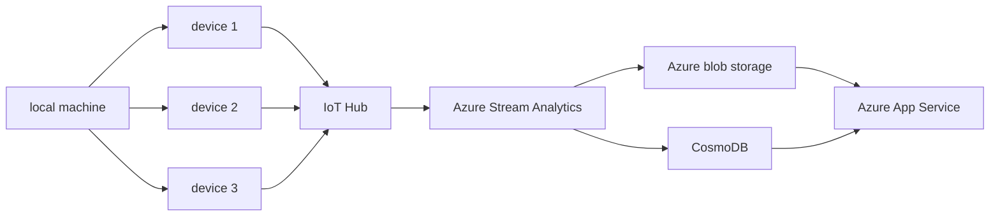
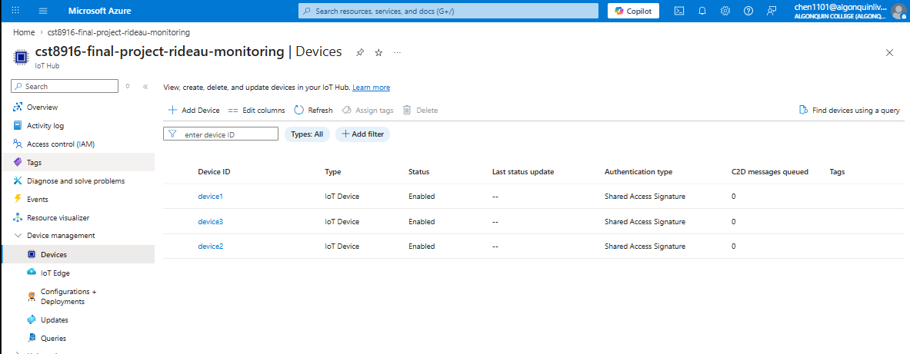
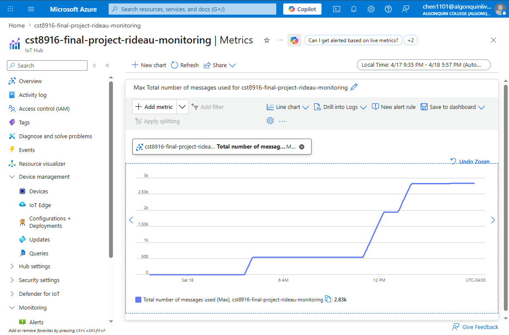
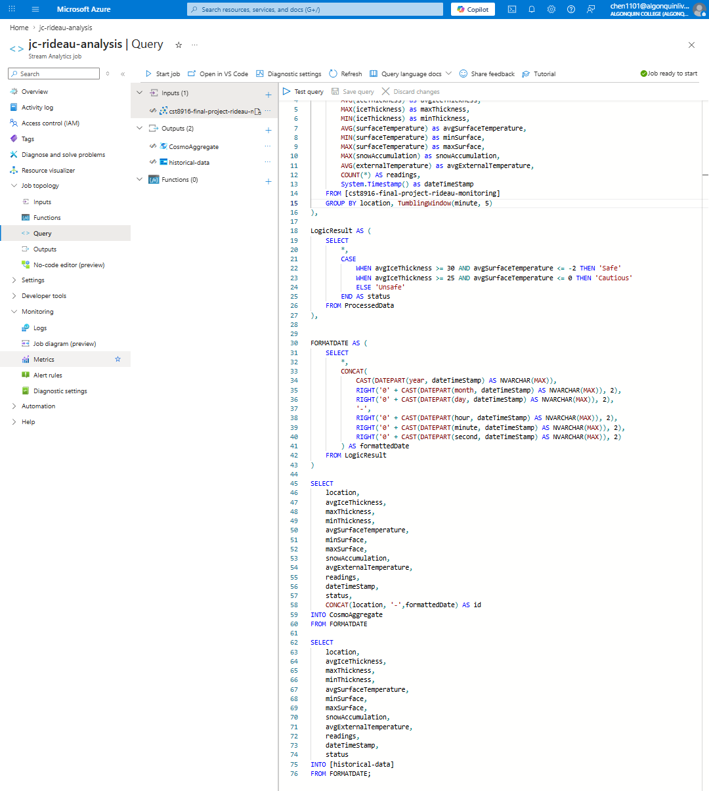
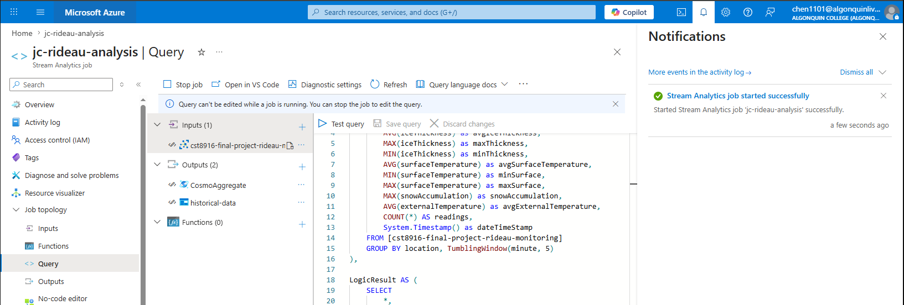
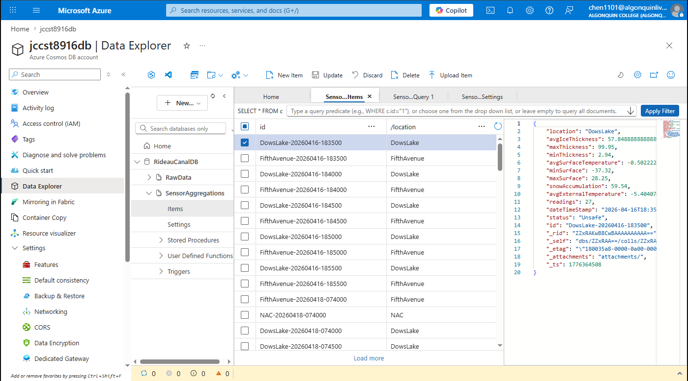
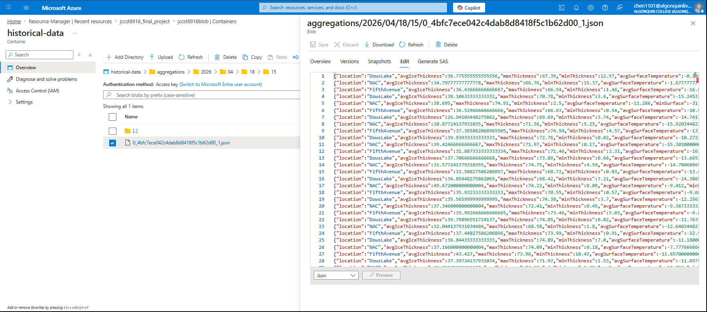
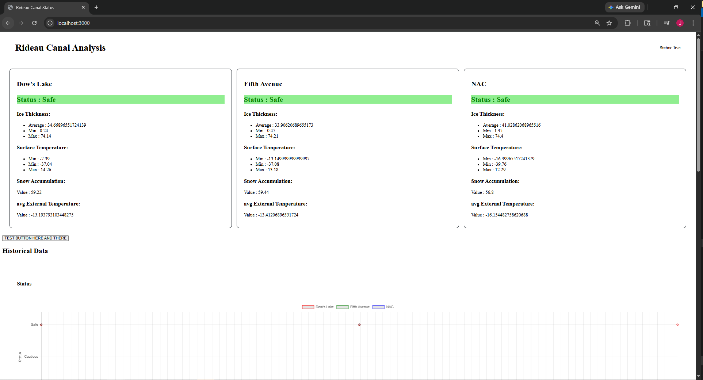
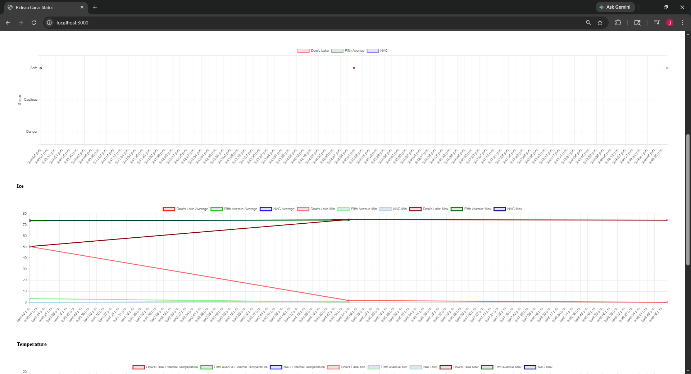
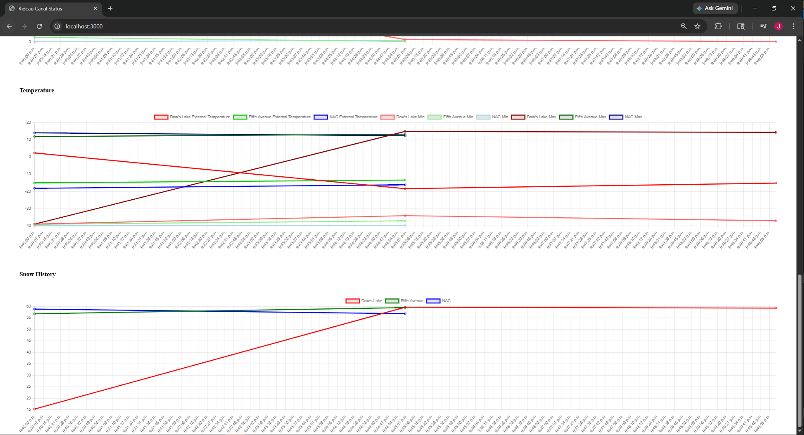

# CST8916 Final Project Documentation

## Real-time Monitoring System for Rideau Canal Skateway

The Rideau Canal monitoring system receives information from sensors surrounding different portions of the Rideau Canal. These sensors collect information regarding the ice and weather surrounding its location. This information is then sent to an Azure IoT Hub, where it will be processed by an Azure Stream Analytics and then stored in an Azure Blob Storage and Azure CosmoDB. It would then be displayed on an Azure App Services webpage that contains a webpage displaying the safety status of the ice as well as the historical information. 

## Studen information
**Student Name**: Joshua Chen

**Student ID**: 041280453

**Course**: CST8916 Real-Time Data 

**Semester**: Winter 2026

### **Repository links**
#### 1. Main Documentation Repository
- **URL:** https://github.com/JChen-AC/cst8916_final_project_documentation
- **Description:** Complete project documentation, architecture, screenshots, and guides

#### 2. Sensor Simulation Repository
- **URL:** https://github.com/JChen-AC/cst8916_final_project_rideau_canal_sensor_simulation
- **Description:** IoT sensor simulator code

#### 3. Web Dashboard Repository
- **URL:** https://github.com/JChen-AC/cst8916_final_project_rideau-canal-dashboard
- **Description:** Web dashboard application

## Scenario Overview

### Problem statement 

The Rideau Canal Skateway requires constant monitoring to ensure skaters' safety. The National Capital Comission (NCC) requires a real time data streaming and visualization system to determine the safety of the skateway and to alert the public of its condition. 

### System Objective 

The system requires accepting and processing thousands of sensor data in real time, storing the information to analyze trends, and displaying this information in a dashboard that provides real time updates on the ice's condition.

## System Architecture 

### Diagram

### Data flow

In this project, the data starts from the local machine. This machine spins up 3 workers that act as devices that can generate simulated data based on the worker ID. 

In reality, the devices would be the starting point for the data as they represent the different sensors connected to the IoT Hub. But since this is just a simulation of the data, it starts at the local machine. The devices are connected using Azure IoT SKD for python and a client of each device would be created and given to each worker/thread. It would then send the information to the IoT hub using said client.

From the devices, the information is sent to the IoT Hub, with each device creating a new set of data every 10 seconds. 
These events/data are collected by the IoT Hub, which retains them for a day. 

From there, an Azure Stream Analytics will query the IoT hub every 5 minutes, gathering all the events/data that the IoT received since the last 5 minute query. The Azure Stream Analytics would analyze the data and then save the results in both the Azure Blob Storage and an Azure CosmoDB. The Blob Storage holds the historical data and records in a directory where each year, month, and day are separate directories. The Azure Stream Analytics would also send the information to CosmoDB, which is used to store the most recent information. The Azure Blob Storage and Azure CosmoDB would then be queried by the dashbourd using the Azure Blob Storage and Azure Stream Analytics using the SDK that was provided and routes. This information would then be displayed on the dashboard through components such as cards and charts. 

### Azure services 
- IoT Hub
- Azure Stream Analytics
- Azure CosmoDB
- Azure Blob storage (and storage account)
- Azure App Services 

## Implementation Overview 
### IoT Sensor Simulation 
Repo Link: https://github.com/JChen-AC/cst8916_final_project_rideau_canal_sensor_simulation
The IoT Sensor Simulation is responsible for simulating the devices/sensors connected to the IoT Hub. This is done by creating multiple threads, one for each device, which is responsible for creating the data and sending it to the IoT Hub. Each worker corresponds to a preset connection string. 

### Azure IoT Hub Configuration 
The Azure IoT Hub Configuration is responsible for collecting and retaining the events/data generated by the devices/sensors. 

The Azure IoT Hub was configured in the basic way any IoT Hub would be configured, with a focus on cost. The only change is adding 3 devices with their default settings, which will be used for the host of the connection string needed to access the IoT Hub. 

### Stream Analytics Job
The Stream Analytics Job queries the IoT Hub every 5 minutes, getting the events that happened within that time period. It would aggregate the data and analyze it to determine the safety of the ice conditions. Finally, it would then send the information to an Azure Blob Storage, where it stores the historical portions, and an Azure CosmoDB which contains the most recent information.

The Stream Analytics Job was created using the default method, with a priority of keeping cost down. The only changes are to the Inputs, Outputs, and Query as can be seen below. 

#### Inputs 
IoT Hub using the selected IoT Hub from your subscription option and using the Connection String method to connect to it.

#### Outputs 
CosmoDB using the selecting CosmoDB from your subscription option, choosing the subscription, account ID (of the CosmoDB), the Database (by selecting "Use existing" option), and Container name (by selecting "Use existing" option) and selecting the connection string. The Document ID is also set to id. 

Blob Storage using the selecting Blob Storage from your subscription option, choosing the subscription, storage account, container, and connection string associated with the project. Additionally, the Path Pattern is set to 

    aggregations/{date}/{time}

#### Query 
The following query was used : 

    WITH ProcessedData AS (
        SELECT 
            Replace(REPLACE(location,' ',''),'''','') as location,
            AVG(iceThickness) as avgIceThickness,
            MAX(iceThickness) as maxThickness,
            MIN(iceThickness) as minThickness,
            AVG(surfaceTemperature) as avgSurfaceTemperature,
            MIN(surfaceTemperature) as minSurface,
            MAX(surfaceTemperature) as maxSurface,
            MAX(snowAccumulation) as snowAccumulation,
            AVG(externalTemperature) as avgExternalTemperature,
            COUNT(*) AS readings,
            System.Timestamp() as dateTimeStamp
        FROM [cst8916-final-project-rideau-monitoring]
        GROUP BY location, TumblingWindow(minute, 5)
    ),

    LogicResult AS (
        SELECT
            *,        
            CASE
                WHEN avgIceThickness >= 30 AND avgSurfaceTemperature <= -2 THEN 'Safe'
                WHEN avgIceThickness >= 25 AND avgSurfaceTemperature <= 0 THEN 'Cautious'
                ELSE 'Unsafe'
            END AS status 
        FROM ProcessedData
    ),

    FORMATDATE AS (
        SELECT 
            *,
            CONCAT(
                CAST(DATEPART(year, dateTimeStamp) AS NVARCHAR(MAX)),
                RIGHT('0' + CAST(DATEPART(month, dateTimeStamp) AS NVARCHAR(MAX)), 2),
                RIGHT('0' + CAST(DATEPART(day, dateTimeStamp) AS NVARCHAR(MAX)), 2),
                '-',
                RIGHT('0' + CAST(DATEPART(hour, dateTimeStamp) AS NVARCHAR(MAX)), 2),
                RIGHT('0' + CAST(DATEPART(minute, dateTimeStamp) AS NVARCHAR(MAX)), 2),
                RIGHT('0' + CAST(DATEPART(second, dateTimeStamp) AS NVARCHAR(MAX)), 2)
            ) AS formattedDate
        FROM LogicResult
    )

    SELECT 
        location,
        avgIceThickness,
        maxThickness,
        minThickness,
        avgSurfaceTemperature,
        minSurface,
        maxSurface,
        snowAccumulation,
        avgExternalTemperature,
        readings,
        dateTimeStamp,
        status,
        CONCAT(location, '-',formattedDate) AS id
    INTO CosmoAggregate
    FROM FORMATDATE

    SELECT
        location,
        avgIceThickness,
        maxThickness,
        minThickness,
        avgSurfaceTemperature,
        minSurface,
        maxSurface,
        snowAccumulation,
        avgExternalTemperature,
        readings,
        dateTimeStamp,
        status
    INTO [historical-data]
    FROM FORMATDATE;

### CosmoDB setup
The Azure CosmoDB is used to store the most recent aggregated data. The set up and configuration follow the basic configuration. The only changes are that you create a database called RideauCanalDB and within that database you create a container called SensorAggregations with a partition key of /location and a document ID of {location}-{timestamp}

### Blob Storage configuration 
The Blob Storage is used to store the historical aggregated data. The set up and configuration is the default configuration. It has a container named "historical-data" and within that container, it contains the file structure of aggregation/YYYY/MM/DD/HR. Where YYYY is the year, MM is the month, DD is the day, and HR is the hour. Within the hour folder is the .json files that are stored from the Stream Analytics Job. A Shared Access Signature was created and used for the connection string and key used in the backend code. 

### Web dashboard and Azure deployment 
#### Dashboard 
Repo link : https://github.com/JChen-AC/cst8916_final_project_rideau-canal-dashboard

The Dashboard is a Node.js program that is used to display the aggregated data in real time. It does so by querying the Azure CosmoDB and Azure Blob Storage every 30 seconds, where it displays the most recent information on cards and the historical data on graphs. 

#### Azure App Services 
The Azure App Service is used to host the Dashboard application. In terms of set up and configuration on the basic tab, choose the same region as the rest of the services and no redundnacy. Set the publish to code and the runtime stack to Node.js 20. In the Deployment tab, select continuous deployment and connect your GitHub Account to it. For the repository, select the forked version of this repo and the branch set to main. In the networking tab set ensure that public access is enabled; everything else can be left to default. 

## Repository Links
### 1. Main Documentation Repository
- **URL:** https://github.com/JChen-AC/cst8916_final_project_documentation
- **Description:** Complete project documentation, architecture, screenshots, and guides

### 2. Sensor Simulation Repository
- **URL:** https://github.com/JChen-AC/cst8916_final_project_rideau_canal_sensor_simulation
- **Description:** IoT sensor simulator code

### 3. Web Dashboard Repository
- **URL:** https://github.com/JChen-AC/cst8916_final_project_rideau-canal-dashboard
- **Description:** Web dashboard application

## Demo Video
https://www.youtube.com/watch?v=YYz5cTpf-CQ 

## Setup Instructions 
### Prerequisites 

- Have an Azure Account
- Ensure that all resources can be created in the same region. 
- Have Python, pip, and Python Virtual Environment installed on a local machine. 
- Have access to the repositories 

### High level set up steps 
1) Fork the Dashboard and simulation repos. 
2) Create an Azure IoT Hub and add 3 devices to it 
3) Create an Azure CosmoDB, adding a database called RideauCanalDB, a container called Sensor Aggregations with a partition key of /location and a document ID of {location}-{timestamp}
4) Create an Azure Blob Storage and creating a container called historical-data
5) Create an Azure Stream Analytics adding the IoT Hub as an input and Azure CosmoDB and Azure Blob Storage as outputs
6) Copy the query into the query of the Azure Stream Analytics 
7) Create an Azure App Service and follow the following instructions : 
8) download the Simulation repo onto your local machine and set up the virtual environment and dependencies 
9) Set up the environment variables 
10) Run the script 

### links to detailed setup in component repo 

- Simulation : https://github.com/JChen-AC/cst8916_final_project_rideau-canal-dashboard#prerequisites
- Dashboard : https://github.com/JChen-AC/cst8916_final_project_rideau_canal_sensor_simulation/blob/main/README.md#prerequisites

## Results and Analysis 
### screenshots 
#### IoT Hub with 3 registered devices

#### IoT Hub metrics showing messages received

#### Stream Analytics query editor with your query

#### Stream Analytics job in "Running" state

#### Cosmos DB Data Explorer with sample documents

#### Blob Storage container with archived files

#### Dashboard running locally (showing live data)

### data analysis

The data analysis is done using Azure Stream Analytics. Where the query collects 5 minutes' worth of data and aggregates the values together. It then checks the average surface temperature and average ice thickness to see if it falls within the safety, cautious, or danger requirements. 

While the average surface temperature and ice thickness are used, I believe that the minimum values should be used instead for added security. If the average ice thickness is used, it hides the fact that some ice thickness might be less than the safety requirements. As such, that portion of the ice would not be safe to go on. However, the average thickness was used to show safer conditions. 

I also believe that the generated data does not reflect real life due to random numbers being chosen. As such, the temperature and ice thickness can vary greatly within 10 seconds. When in reality it takes hours, days, or even weeks for such changes to happen in real life. This would have an effect on the analysis as it can change the safety results. Additionally, it would make it harder to track historical trends due to the randomness of the data, causing no real pattern to be formed. 

### system performance observation 

The performance of the system is good, everything works as expected, and data generation and page refreshes happen during the expected times. 

## Challenges 

### Azure Stream Analytics Queries
One of the challenges I faced was setting up the Document Id and Path Pattern for Azure Stream Analytics. Due to developing in the portal and never using these output options, I was did not know how to set it up properly. Additionally, the query editor on the portal didn't provide much help, especially when I was not sure where the error was. To solve the challenge, I researched how to set it up, looking at Stack Overflow, but mainly used AI to review the code and point out any issues that it sees. From there, I would ask it questions on why it did things a certain way or why something was the problem. 

Some things that I have learned is how to part out and concatenate the date. As well as how output queries cannot have the * followed by other select queries in them and that you need to specify the outputs. I also learned a good strategy on how to determine where errors are within the query editor, especially when you have multiple tables. Which is simply just add a single table at a time and slowly remove or add things until you find the error

## AI Disclosure 
AI was used extensively in this project and repository
Note : All code generated with AI will have a comment stating that it was generated or AI generated code was the primary base

### Simulation
ChatGPT was used in the following ways :
- research threading and how to use it for the execution frequency 
- used to help debug .env error where I was unable to get values from it
- research how and why you need a separate connection string per worker/producer 
- research how to set up an Azure IoT Hub, how it works, how to add devices, and how to add a client in Python 

Claude was used in the following ways:
- Help determine what is needed for the documentation

### Dashboard
ChatGPT and Claude were used extensively in the following ways
- to help understand the project structure for a node.js project
- to learn the basics of node.js 
- help understand the functions needed to get data from Azure CosmoDB using node.js 
- to learn the basics of chart.js and generate code for the basic templates that the charts were created from
- Generated code to provide a custom Y scale and hover over points functionality 
- Used extensively to debug the routes and their connection to the Azure services, as well as sending data to the dashboard/front end 
- Used to generate code to communicate with the Blob Storage, (functions to determine the latest folder)
- provide colour codes for the chart
- used to help determine what content to put in the documentation

ChatGPT and Claude were used in the following ways:
- for debugging the queries as well as understanding the different functions offered by Azure Stream Analytics
    - Especially helping to understand the issue with the Path Pattern and Document ID
- general debugging for all files 

## References 
- https://learn.microsoft.com/en-us/azure/storage/blobs/storage-quickstart-blobs-nodejs?tabs=managed-identity%2Croles-azure-portal%2Csign-in-azure-cli&pivots=blob-storage-quickstart-scratch
- https://stackoverflow.com/questions/46814183/stream-analytics-to-cosmosdb-always-fails
- https://www.chartjs.org/docs/latest/configuration/responsive.html
- https://www.geeksforgeeks.org/javascript/chartjs-canvas-resize/

