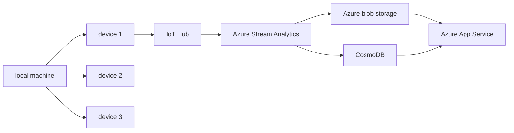

# CST8916 Final Project Documentation

## Rideau Canal System

The rideau Canal monitoring system that receives information from sensors surrounding different portions of the Rideau Canal. These sensors collect information regarding the ice and weather surrounding its location. This information is then sent to an Azure IoT Hub, where it will be processed by an Azure Stream Analysis and then stored in an Azure Blob Storage and Azure CosmoDB. It would then be displayed on an Azure App Services webpage that contains a webapage displaying the safety status of the ice as well as the historical information. 

## Studen information
**Student Name**: Joshua Chen

**Student ID**: 041280453

**Course**: CST8916 Real-Time Data 

**Semester**: Winter 2026

**Repository links**
- Simulation : 
- Documentation : 
- Dashboard : 

## Scenario Overview

### Problem statement 

The Rideau Canal Skateway requires constant monitoring to ensure skater's safety. The National Capital Comission (NCC) requires a real time data streaming and visualization system to determine the safety of the skateway and to alert the public of its condition. 

### System Objective 

The system requires to accept and process thousands of sensor data in real time, storing the information to analyze trends and to display this information in dashboard that provides real time updates on the ice's condition.

## System Architecture 

### Diagram

### Data flow

### Azure services 
- IoT Hub
- Azure Stream Analytics
- Azure CosmoDB
- Azure Blob storage (and storage account)
- Azure App Services 

## Implementation Overview 
### IoT Sensor Simulation 
Repo Link 
### Azure IoT Hub Configuration 

### Stream Analytics Job
#### Inputs 
#### Outputs 
#### Query 

### CosmoDB setup

### Blob storage configuration 

### Web dashboard and Azure deployment 
#### Dashboard 
Repo link
#### Azure App Services 

## Repository Links

## Demo Video

## Setup Instructions 
### Prerequisites 
### High level set up steps 
### links to detailed setup in component repo 

## Results and Analysis 
### screenshots 
### data analysis
### system perfromance observation 

## Challenges 
#### Technical

## AI Disclosure 

Pluse specific 

ChatGPT and Claude was used in the following ways:
- for debugging the queries as well as understanding different functions.
    - also help with understanding the path and direcroy id 

## References 
- AI 
- microsoft thing 

